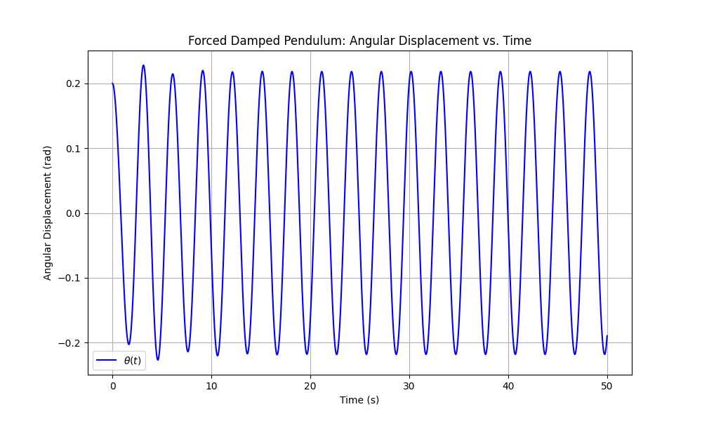

# Forced Damped Pendulum Dynamics

## Theoretical Foundations

### Governing Equation

The forced damped pendulum is described by:

$$ \frac{d^2\theta}{dt^2} + \frac{b}{m}\frac{d\theta}{dt} + \frac{g}{L}\sin\theta = \frac{F_d}{mL}\cos(\omega_d t) $$

Where:
- $\theta$: Angular displacement
- $b$: Damping coefficient
- $m$: Mass of bob
- $L$: Length of rod
- $g$: Gravitational acceleration
- $F_d$: Driving force amplitude
- $\omega_d$: Driving frequency

### Small Angle Approximation

For $\theta \ll 1$ radian ($\sin\theta \approx \theta$):

$$ \frac{d^2\theta}{dt^2} + 2\beta\frac{d\theta}{dt} + \omega_0^2\theta = A\cos(\omega_d t) $$

Where:
- $\beta = b/2m$: Damping parameter
- $\omega_0 = \sqrt{g/L}$: Natural frequency
- $A = F_d/mL$: Driving amplitude

### Resonance Conditions

1. **Amplitude Resonance:**
   Occurs at driving frequency:
   $$ \omega_{amp} = \sqrt{\omega_0^2 - 2\beta^2} $$

2. **Velocity Resonance:**
   Occurs exactly at $\omega_0$

## Dynamic Behavior Analysis

### Parameter Space Overview

| Parameter | Effect on System |
|-----------|------------------|
| $\beta$ (Damping) | Higher $\beta$ reduces oscillation amplitude and widens resonance peak |
| $A$ (Drive Amplitude) | Higher $A$ increases response amplitude and can induce chaos |
| $\omega_d/\omega_0$ (Frequency Ratio) | Determines resonance and synchronization |

### Characteristic Regimes

1. **Underdamped ($\beta < \omega_0$):**
   - Transient oscillations before settling to driven motion
   - Clear resonance peak

2. **Critically Damped ($\beta = \omega_0$):**
   - Fastest return to equilibrium without oscillation

3. **Overdamped ($\beta > \omega_0$):**
   - Slow return to equilibrium

4. **Nonlinear Regime (Large $\theta$):**
   - Potential for chaotic behavior
   - Period doubling routes to chaos

## Practical Applications

1. **Structural Engineering:**
   - Bridge oscillations in wind
   - Building response to earthquakes

2. **Energy Harvesting:**
   - Optimizing pendulum-based wave energy converters

3. **Timekeeping:**
   - Precision clock mechanisms

4. **Biological Systems:**
   - Limb motion during walking

## Numerical Analysis Approach

### Key Visualizations

1. **Time Series:**
   - Angular displacement vs time
   - Velocity vs time

2. **Phase Space:**
   - $\dot{\theta}$ vs $\theta$

3. **Poincaré Sections:**
   - Stroboscopic sampling at driving period

4. **Bifurcation Diagrams:**
   - Behavior vs control parameter (e.g., $F_d$)

### Numerical Considerations

1. **Integration Methods:**
   - Runge-Kutta (4th order recommended)
   - Small time steps for chaotic regimes

2. **Initial Conditions:**
   - Important in nonlinear regimes
   - May need to discard transient

## Model Limitations

1. **Idealized Damping:**
   - Real systems often have nonlinear damping

2. **Point Mass Assumption:**
   - Neglects distributed mass effects

3. **Rigid Rod:**
   - Real pendulums have flexure

4. **2D Motion:**
   - Real pendulums can exhibit 3D motion

## Extensions

1. **Nonlinear Damping:**
   $$ \text{Add } \mu \dot{\theta}^2 \text{ term} $$

2. **Parametric Driving:**
   $$ \text{Modify } L = L_0 + \Delta L\cos(\omega_p t) $$

3. **Double Pendulum:**
   - Coupled oscillators
   - Enhanced chaotic behavior

## Analytical Solutions (Small Angle)

### Steady-State Solution

$$ \theta(t) = \theta_0\cos(\omega_d t - \phi) $$

Where:
- Amplitude:
  $$ \theta_0 = \frac{A}{\sqrt{(\omega_0^2-\omega_d^2)^2 + (2\beta\omega_d)^2}} $$
- Phase lag:
  $$ \phi = \tan^{-1}\left(\frac{2\beta\omega_d}{\omega_0^2-\omega_d^2}\right) $$

### Quality Factor

$$ Q = \frac{\omega_0}{2\beta} $$

Higher Q means sharper resonance peak
