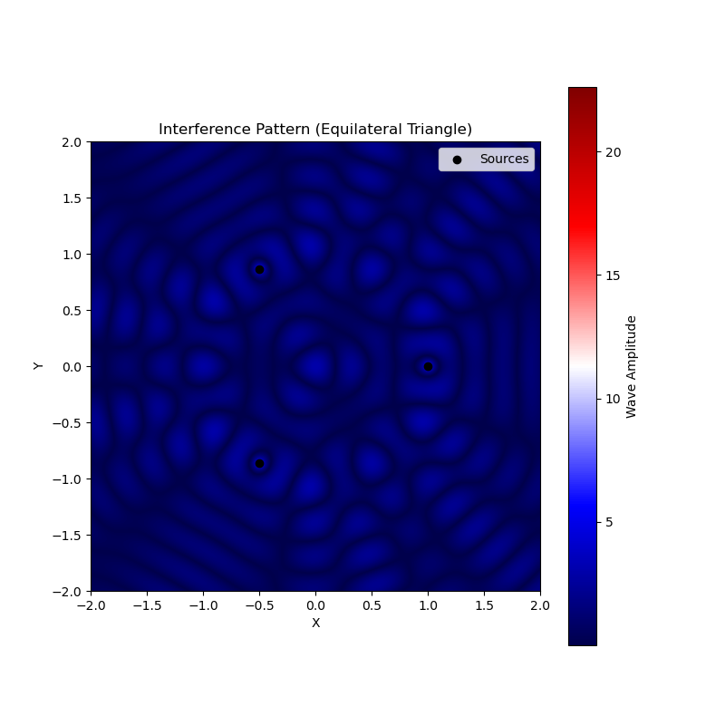
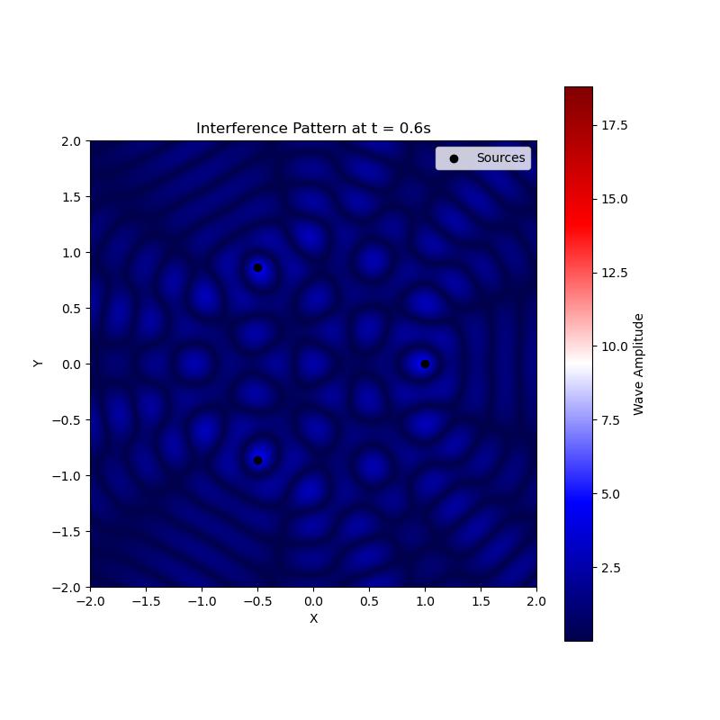

# Waves: Interference Patterns from Regular Polygon Sources

## Problem Statement
Analyze interference patterns created by wave sources placed at the vertices of a regular polygon on a water surface. The superposition of these circular waves produces distinctive patterns of constructive and destructive interference.

## Wave Equation for Single Source
Each point source at vertex position \((x_i, y_i)\) generates a circular wave described by:

\[
\eta_i(x, y, t) = \frac{A}{\sqrt{r_i}} \cdot \cos(kr_i - \omega t + \phi)
\]

where:
- \(r_i = \sqrt{(x - x_i)^2 + (y - y_i)^2}\) (distance from source \(i\))
- \(k = \frac{2\pi}{\lambda}\) (wavenumber)
- \(\omega = 2\pi f\) (angular frequency)
- \(\phi\) = initial phase (same for all sources)

## Solution Methodology

4

### 1. Regular Polygon Configuration
For an N-sided regular polygon with radius \(R\):
- Vertex positions: \((x_i, y_i) = (R\cos\theta_i, R\sin\theta_i)\)
- \(\theta_i = \frac{2\pi i}{N}\) for \(i = 0,1,...,N-1\)

### 2. Superposition Principle
Total wave displacement at any point:

\[
\eta_{\text{sum}}(x, y, t) = \sum_{i=0}^{N-1} \frac{A}{\sqrt{r_i}} \cos(kr_i - \omega t)
\]

## Example: Equilateral Triangle (N=3)

### Vertex Positions
\[
\begin{cases}
(x_0, y_0) = (R, 0) \\
(x_1, y_1) = (-\frac{R}{2}, \frac{R\sqrt{3}}{2}) \\
(x_2, y_2) = (-\frac{R}{2}, -\frac{R\sqrt{3}}{2})
\end{cases}
\]

### Characteristic Patterns
1. **Central Region**: 
   - Symmetric interference
   - Six-fold pattern of maxima/minima

2. **Edge Regions**:
   - Complex interference fringes
   - Directional propagation patterns

## Visualization Approach
1. **Spatial Map**:
   - Plot \(|\eta_{\text{sum}}|\) over a grid
   - Color mapping for wave amplitude

2. **Time Evolution**:
   - Animate wave propagation
   - Highlight phase relationships

## Key Findings
| Polygon Type | Characteristic Pattern | Notable Features |
|--------------|------------------------|------------------|
| Triangle (3) | 6-fold symmetry | Strong central interference |
| Square (4)   | 8-lobed pattern | Clear diagonal maxima |
| Pentagon (5) | 10-armed spiral | Rotating interference bands |

## Physical Interpretation
1. **Symmetry Effects**:
   - N sources → 2N-fold interference symmetry
   - Polygon rotation preserved in pattern

2. **Distance Decay**:
   - \(\frac{1}{\sqrt{r}}\) amplitude decay
   - Far-field pattern simplification

## Deliverables

1. **Mathematical Analysis**:
   - Complete derivation of superposition
   - Phase difference calculations

2. **Visualizations**:
   - Static interference patterns
   - Time evolution animations

3. **Discussion**:
   - Comparison of different polygons
   - Real-world water wave analogs
